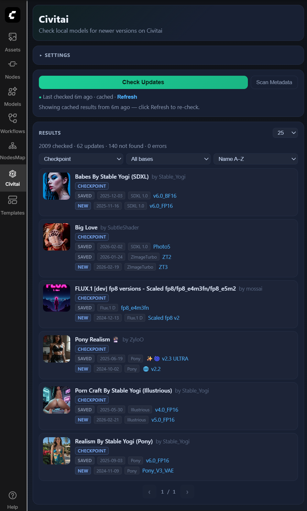

# Civitai Updater for ComfyUI


ComfyUI custom node extension focused on update visibility for local Civitai models.



## Core UX

- `Check Updates` compares local model versions with latest Civitai releases.
- `Scan Metadata` refreshes sidecar metadata only.
- Results are paginated (25/50/100) and filterable.
- Long jobs support `Pause/Resume` and `Stop`.

`Version` means a specific Civitai release of a model.

## Installation

1. Put this repo under ComfyUI `custom_nodes` (or create a junction/symlink).
2. Restart ComfyUI.
3. Open `Civitai` in the sidebar.

Windows junction example:

```powershell
$src = "C:\Users\grego\Documents\Coding\comfyui-civitai-updater"
$dst = "C:\Users\grego\Documents\StableDiffusion\ComfyUI-2602\custom_nodes\comfyui-civitai-updater"
New-Item -ItemType Junction -Path $dst -Target $src
```

## Settings

Use `Settings -> Civitai Updater`.

- API key (optional)
- cache TTL
- timeout / retries / per-model delay
- path sources:
  - Comfy default paths
  - `extra_model_paths.yaml`
  - custom paths per model type

## API Snapshot

- `GET /civitai-updater/config`
- `POST /civitai-updater/config`
- `POST /civitai-updater/jobs/scan`
- `POST /civitai-updater/jobs/check-updates`
- `GET /civitai-updater/jobs/{job_id}`
- `GET /civitai-updater/jobs/{job_id}/items?offset&limit&mode=updates`
- `POST /civitai-updater/jobs/{job_id}/pause`
- `POST /civitai-updater/jobs/{job_id}/resume`
- `POST /civitai-updater/jobs/{job_id}/stop`

## Attribution

This project was built based on:
- https://github.com/zixaphir/Stable-Diffusion-Webui-Civitai-Helper
