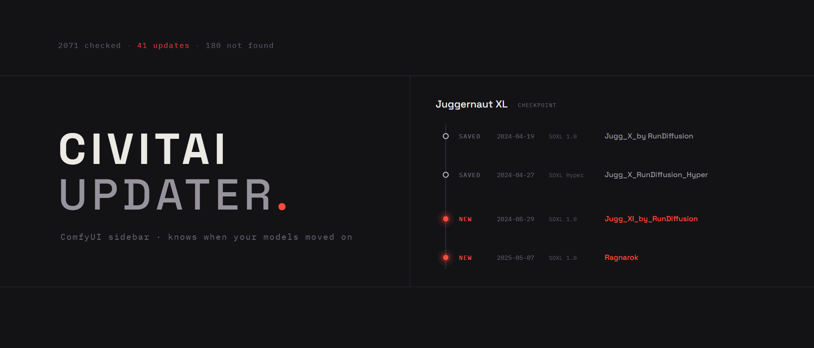
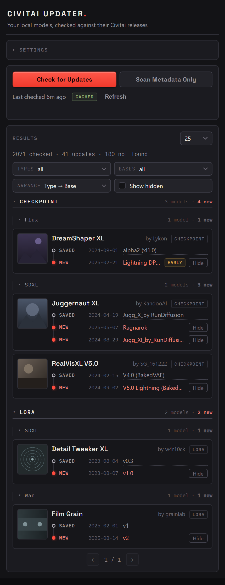

# Civitai Updater

A ComfyUI sidebar panel that checks the models on your disk against their
Civitai releases, and tells you which ones have moved on without you.

It reads what you already have — model files and their `.civitai.info`
sidecars — identifies each one by SHA256 hash, and lists only the models with
a newer release. Nothing is downloaded for you and nothing is overwritten: the
panel links you to the release page and gets out of the way.



## Reading the panel

Every model card is a small ledger of that model's releases. The dot on the
left says where each version stands:

| Dot | Row | Meaning |
| --- | --- | --- |
| ○ | `SAVED` | A version you have on disk. Click the name to copy its file path. |
| ○ | `METADATA` | Tracked from a `.civitai.info` sidecar with no model weights next to it. |
| ● | `NEW` | Published after your newest local version. Click the name to open it on Civitai. |
| ● | `HIDDEN` | A new release you chose to hide. Shown only with **Show hidden** on. |

Red means exactly one thing: a release exists that you do not have. A quiet
card is an up-to-date card.

Base models are grouped by family, because Civitai records one per version and
the spellings multiply: `Flux.1 D`, `Flux.2 Klein 9B` and `Flux.2 Klein 9B-base`
all file under **Flux**, while every row still prints its exact base. A model
page can carry releases on several base models, so a card is filed under the
base of the release it is headlining. Unrecognised values keep their own name
instead of being swept into a catch-all.

A version counts as **new** when its `publishedAt` date (or `createdAt`, when
`publishedAt` is missing) is later than the newest local version you have of
that model — not by version number, which creators format however they like.

## Installing

1. Put this repo in ComfyUI's `custom_nodes` folder, or install **Civitai
   Updater** from the ComfyUI Registry.
2. Restart ComfyUI.
3. Open **Civitai** in the sidebar.

Windows junction, if you keep the source elsewhere:

```powershell
$src = "C:\path\to\civitai-updater"
$dst = "C:\path\to\ComfyUI\custom_nodes\civitai-updater"
New-Item -ItemType Junction -Path $dst -Target $src
```

Requires Python 3.9+. Pulls in `requests`, `Pillow`, and `imageio-ffmpeg`
(the last one only to turn video previews into thumbnails).

## Using it

- **Check for Updates** — scans your files and compares them with Civitai.
  Results from the previous check stay on screen, marked provisional, and each
  card refreshes in place as its model is re-checked. Stopping the job keeps
  what it had already found.
- **Fetch Missing Metadata** — downloads `.civitai.info` sidecars and preview
  images for models that are missing them. Files that already have metadata are
  skipped and nothing is compared for updates, so it is the cheap way to
  populate names, base models, and thumbnails after adding a batch of models.
  Tick **Refetch metadata that already exists** to re-pull the ones you have.
- Long jobs can be paused, resumed, or stopped, and survive a page reload.
- **Arrange** groups the list two levels deep and sorts within it. The default
  is model type, then base model, sorted A–Z; sort by **Furthest behind** to
  lead with the models that have drifted the most.
- Group headers count what is waiting (`3 models · 4 new`) across the whole
  result set, and collapse to put a type aside. A group that runs past a page
  break repeats its header marked `cont.`
- Results are filterable by model type and base model, paginated (25/50/100),
  and any release you are not interested in can be hidden.
- Click a thumbnail to compare your local preview against the new release.

## Settings

Under **Settings → Civitai Updater**:

- **API key** — optional, but some restricted resources need one.
- **Cache duration** — how long results stay fresh before a re-check is
  suggested. The panel also notices when model files are added or removed.
- **Timeout, retries, delay between models** — for slow or rate-limited runs.
- **Treat `.civitai.info` as installed** — count a valid orphan sidecar as an
  installed version, so a model you deleted but still track keeps reporting
  updates. On by default.
- **Mature content** — **Show** everything, **Blur previews** (the image only;
  titles stay readable so you can still tell which model it is), or **Hide
  mature models**, which removes them from results and reports how many were
  left out rather than quietly shrinking the list.
- **Path sources** — ComfyUI's own folders, `extra_model_paths.yaml`, and
  custom roots per model type (checkpoint, LoRA, VAE, UNet, embedding).

## Why civitai.red

Since Civitai split into two domains in April 2026, `civitai.com` serves
SFW-filtered API responses. Hash lookups for mature models come back empty
there, which showed up as models that could never be identified. This
extension talks to `civitai.red`, which serves the full catalogue, and links
to it as well. Set your API key if a resource still refuses to resolve.

## HTTP routes

All registered on ComfyUI's `PromptServer`:

```
GET  /civitai-updater/config
POST /civitai-updater/config
POST /civitai-updater/jobs/scan
POST /civitai-updater/jobs/check-updates
GET  /civitai-updater/jobs/active
GET  /civitai-updater/jobs/{job_id}
GET  /civitai-updater/jobs/{job_id}/items?groupBy&thenBy&sort&collapsed&mature
POST /civitai-updater/jobs/{job_id}/pause | /resume | /stop
GET  /civitai-updater/last-check
POST /civitai-updater/archived-updates
POST /civitai-updater/archived-updates/restore
```

See [wiki/API.md](wiki/API.md) for parameters and responses.

## Credits

Built on ideas from
[Stable-Diffusion-Webui-Civitai-Helper](https://github.com/zixaphir/Stable-Diffusion-Webui-Civitai-Helper).

Model names shown in the screenshot are real, publicly listed Civitai models;
the thumbnails are stand-in artwork, not their preview images.

Developed with AI assistance (GPT-5.3-Codex, Claude Opus 4.6, Claude Opus 5).

Licensed under the [MIT License](LICENSE).
